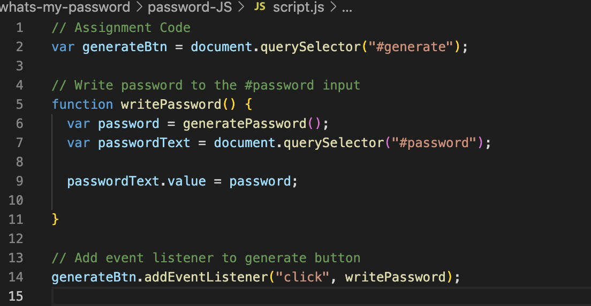

# whats-my-password

## Description 📜
Module 3 tasks us with creating a password generator. This generatoe must be able to create a password with a minumum of 8 and maximum of 128 characters. The process must include prompts which determine lower case and upper case letters and special characters when generating the new password. 

## Motivation 💪🏻
This project was created to use JavaScript 

## Build status 🏗
* The starter code has been built by 

## Code style 🔐
* Standard HTML and CSS has been used for this project. 
The language for the website is written in US English. (USA English)

## Acceptance Criteria ✅
GIVEN I need a new, secure password
* WHEN I click the button to generate a password
THEN I am presented with a series of prompts for password criteria
* WHEN prompted for password criteria
THEN I select which criteria to include in the password
* WHEN prompted for the length of the password
THEN I choose a length of at least 8 characters and no more than 128 characters
* WHEN asked for character types to include in the password
THEN I confirm whether or not to include lowercase, uppercase, numeric, and/or special characters
* WHEN I answer each prompt
THEN my input should be validated and at least one character type should be selected
* WHEN all prompts are answered
THEN a password is generated that matches the selected criteria
* WHEN the password is generated
THEN the password is either displayed in an alert or written to the page

## Assets 📷
Actual preview of ---. 

## Link to the deployed website 💻
URL: 

## Problems encountered 🤯
* geting 

## Changes made to the code 𝌡
* the 

## Credits 💃🏻
* Starter code (HTML and CSS has been provided by Birmingham University Boot Camp. 

* The image for the Starter code (JavaScript) has been begun by Birmingham University.

* Further JavaScript code has been developed by Adela Kobic. 

## Licence 🪪
* MIT Licence 